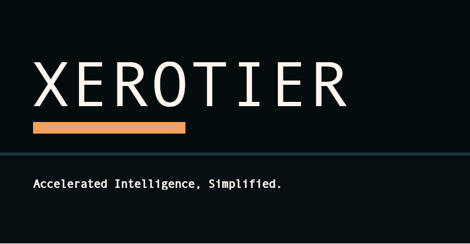

# Xerotier.ai

<div style="text-align: center;">

</div>

A high-performance, acclerated intellegence platform.

Running standalone agents for inferencing and artificial intelligence workloads, is simple and
efficient. Xerotier.ai is designed to be a powerful and flexible platform for running AI
workloads, with a focus on performance and ease of use.

Using the provided compose files, you can quickly set up and run your AI workloads with minimal
configuration. The compose files are designed to be easy to use and customizable, allowing you to
tailor the environment to your specific needs.

## Getting Started

To get started with Xerotier.ai, simply clone the repository and follow the instructions in the
README file. The compose files are located in the `compose` directory, and you can choose
the one that best suits your needs.

Before running the compose files, make sure to set the `XEROTIER_AGENT_JOIN_KEY` environment variable
with your join key. This key is required for the agent to connect to the Xerotier network. You can
obtain a join key from the Xerotier dashboard.

Documentation for running private agents can be found in the [docs](https://xerotier.ai/docs/private-agents),
which provides detailed information on how to use and customize the compose files for your specific use case.

Basic execution is as simple as running the following commands in your terminal:

``` shell
export XEROTIER_AGENT_JOIN_KEY=xxxxxxxx
sudo podman compose -f compose/compose.agent-amd-rocm.yaml down
sudo -E podman compose -f compose/compose.agent-amd-rocm.yaml up -d
sudo podman logs xim-vllm-rocm -f
```

* The first command sets the required environment variable for the join key.
* The second command ensures that any existing containers are stopped and removed.
* The third command starts the new containers in detached mode.
* The last command allows you to view the logs of the running container in real-time.

## MacOS Support

Review the [MacOS README](macos/README.md) for instructions on how to set up and run
Xerotier XIM on MacOS. This guide provides specific steps and requirements for running
the platform on MacOS, ensuring a smooth experience for users of this operating system.
