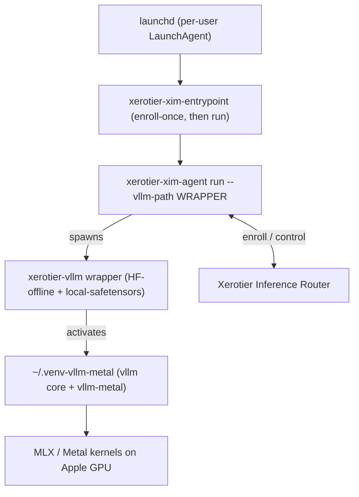

# XIM + vllm-metal on Apple Silicon (native host)

This is the Apple Silicon deployment for the Xerotier inference agent. It runs
`xerotier-xim-agent` natively on macOS with Metal-accelerated vLLM via
[vllm-metal](https://github.com/vllm-project/vllm-metal).

There is intentionally **no container image** for this backend. vllm-metal
requires native macOS Metal access (MLX + Metal kernels, arm64 Python 3.12),
and Apple's `container` binary runs Linux guests with no GPU/Metal passthrough.
For CPU-only containers on a Mac, use `deploy/docker/Dockerfile.xim-vllm-cpu`
(no Apple Silicon GPU acceleration).

## Host topology



## Prerequisites

- Apple Silicon Mac (arm64) running macOS 15 (Sequoia) or newer (the agent uses
  `Synchronization.Mutex`, which requires macOS 15+).
- A Python 3 on PATH (any version; used only by the installer and uv). The
  exact Python 3.12 that vllm-metal requires is provisioned automatically via
  uv, so a 3.13+ default `python3` is fine.
- `curl` on PATH (preinstalled on macOS).
- `uv` (the installer bootstraps it if missing).
- A join key from the dashboard: Infrastructure -> Agents -> Generate Join Key.

The `xerotier-xim-agent` binary is downloaded prebuilt from the newest stable
[`cloudnull/xerotier-public`](https://github.com/cloudnull/xerotier-public/releases)
release (asset `xerotier-xim-agent-Darwin-arm64`), resolved via the releases
API; no Swift toolchain or local build is required. Pass `--pre-release` to
allow installing from a prerelease when no stable release is available.

## Install

From the repository root:

```bash
deploy/macos/xim-metalctl.sh --join-key <YOUR_JOIN_KEY>
```

Add `--pre-release` to install the agent from a prerelease when no stable
release has been published yet:

```bash
deploy/macos/xim-metalctl.sh --join-key <YOUR_JOIN_KEY> --pre-release
```

This will:

1. Preflight the host (arm64, curl, uv) and provision Python 3.12 via uv.
2. Install vllm-metal into `~/.venv-vllm-metal` (builds vLLM core from source).
3. Download the prebuilt `xerotier-xim-agent` from the newest stable release (or a prerelease with `--pre-release`) into `~/.local/bin`.
4. Install the HuggingFace compat shim into the venv site-packages.
5. Render `xerotier-vllm`, `xerotier-xim-entrypoint`, and the LaunchAgent.
6. Load the per-user LaunchAgent (omit with `--no-start`).

## Environment variables

Set these in the LaunchAgent env (the installer injects `--join-key`; edit
`~/Library/LaunchAgents/com.xerotier.xim-agent.plist` for the rest, then reload):

| Variable | Purpose |
| --- | --- |
| `XEROTIER_AGENT_JOIN_KEY` | One-time enrollment key (first run only). |
| `XEROTIER_AGENT_MAX_CONCURRENT` | Max concurrent inference jobs. |
| `XEROTIER_AGENT_LOG_LEVEL` | Agent log level. |
| `XEROTIER_AGENT_ALLOW_INSECURE` | `1`/`true` to allow insecure transport. |
| `XEROTIER_AGENT_METRICS_PORT` | Metrics server port. |
| `XEROTIER_AGENT_DISABLE_METRICS_SERVER` | `1`/`true` to disable metrics. |
| `XEROTIER_AGENT_VLLM_ARGS` | Space-separated extra `vllm` args. |
| `XEROTIER_AGENT_VLLM_ENV` | Space-separated `KEY=VALUE` env for vLLM. |
| `XEROTIER_AGENT_VLLM_PATH` | vLLM launcher (defaults to the wrapper). |
| `XEROTIER_AGENT_AUTO_CONFIGURE_GPU` | Forced to `0` on macOS (MLX uses unified memory; tensor parallelism stays 1). |

## Manage the service

Enable/start or stop/disable the agent via the installer:

```bash
deploy/macos/xim-metalctl.sh --start   # enable + start (now and at login)
deploy/macos/xim-metalctl.sh --stop    # stop + disable (until next --start)
```

Status and logs:

```bash
launchctl print "gui/$(id -u)/com.xerotier.xim-agent" | head -20
tail -f ~/Library/Logs/xerotier/xim-agent.out.log
tail -f ~/Library/Logs/xerotier/xim-agent.err.log
```

## Uninstall

```bash
deploy/macos/xim-metalctl.sh --uninstall          # remove service + rendered files
deploy/macos/xim-metalctl.sh --uninstall --purge  # also remove the agent binary and venv
```

## Smoke test (operator, on real hardware)

1. `deploy/macos/xim-metalctl.sh --join-key <KEY>`
2. Confirm the agent appears in the router fleet (dashboard -> Agents).
3. Issue a chat completion routed to this agent.
4. Confirm Metal is exercised: GPU activity in Activity Monitor / `vllm-metal`
   log lines in `~/Library/Logs/xerotier/xim-agent.err.log`.
